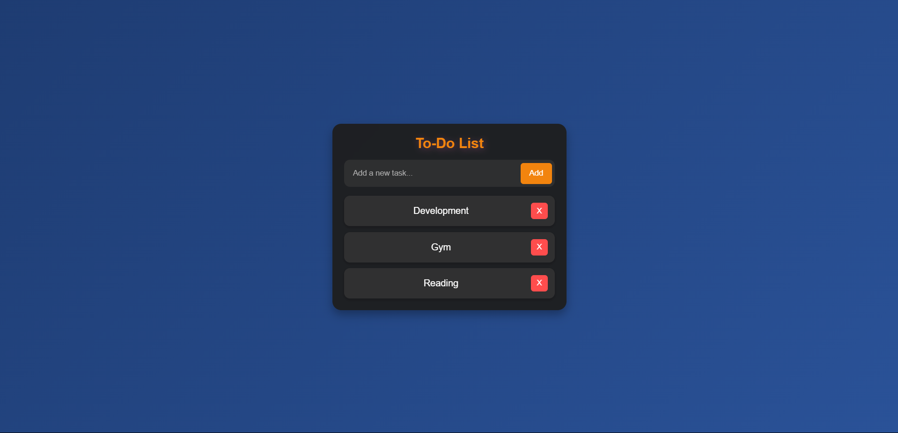

# 📝 Elegant To-Do List Web App

A clean, responsive, and modern to-do list app built using **HTML**, **CSS**, and **JavaScript**. This project emphasizes simplicity, local storage persistence, and stylish UI interactions.

## 🚀 Features

- 🔹 Add, view, and delete tasks
- 🔹 Press **Enter** to quickly add tasks
- 🔹 Persist tasks using **localStorage**
- 🔹 Sleek UI with **glassmorphism** and gradients
- 🔹 Responsive design and smooth animations

## 📸 Demo

 <!-- Replace with actual screenshot if available -->

## 🛠️ Tech Stack

- HTML5
- CSS3 (with modern UI enhancements)
- JavaScript (vanilla)
- LocalStorage for persistence

## 📂 Project Structure

